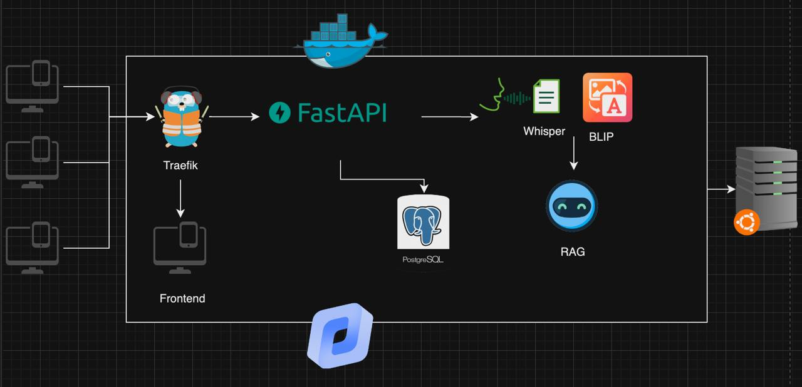

# Импульс Т1

*MISIS x BGITU*

Team Members:

1. **Дмитрий Коноплянников** - Backend, DevOps
2. **Виктория Гайлитис** - Backend
3. **Дарья Короленко** - Design
4. **Ильдар Ишбулатов** - Frontend
5. **Кирилл Рыжичкин** - ML Engineer

Презентация: [тык](https://drive.google.com/file/d/1Yzh4Qd_NESOhQyuyPVrfYPStead8e6uM/view?usp=sharing)

Веб-сервис: [тык](http://51.250.42.179:3000)

Swagger API: [тык](http://51.250.42.179:8000/api/docs)

## Кейс "Окно знаний – цифровой ассистент базы знаний"

> Создайте платформу, которая позволит пользователям на основе собственной базы знаний разрабатывать окна взаимодействия с ассистентом.

## Предложенное решение

### Блок-схема всего решения:



## Полностью кастомизируемый конструктор AI-ассистентов:

- загрузка любой базы знаний (различные сервисы и файлы в любом количестве)
- выбор любой LLM-модели с huggingface (предлагаем популярные варианты, а также даем возможность выбрать собственную модель)
- настройка температуры LLM
- выбор любого ретривера с huggingface (также предлагаем популярные варианты, а также даем возможность выбрать собственный ретривер)
- выбор роли ассистента (например, "разработчик", "аналитик", "ресерчер" и т.д.) с уже заготовленными системными промптами под эти роли
- создание собственной роли ассистента (задание своего системного промпта)
- экспорт ассистента в 3 форматах: API, pop-up, service (также кастомизация цветов и названий ассистента на этом этапе)
- последующее редактирование ассистентов после их сохранения (например, можно добавить новые источники в базу знаний или удалить существующие, сменить модель, ретривер, обновить параметры модели или системный промпт)

### Поддерживаемые форматы источников:

#### Документы:

- pdf
- txt
- word (doc, docx)
- csv
- html
- markdown (md)
- json
- xml
- excel (xls, xlsx)
- audio (mp3)
- images (jpeg, jpg, png, ...)

#### Сервисы:

- confluence
- notion
- github
- youtube
- any url

## Инструкция по запуску решения

### 1. Клонирование репозитория
Склонируйте репозиторий с помощью команды:
```bash
git clone https://github.com/Kin1599/impulse.git
cd impulse
```

### 2. Создание и активация виртуального окружения
Создайте виртуальное окружение, чтобы изолировать зависимости проекта:

- **Windows**:
  ```bash
  python -m venv venv
  venv\Scripts\activate
  ```

- **Linux/MacOS**:
  ```bash
  python3 -m venv venv
  source venv/bin/activate
  ```

### 3. Установка зависимостей
Установите необходимые библиотеки, указанные в файле `requirements.txt`:
```bash
pip install -r requirements.txt
```

### 4. ДАЛЬШЕ ДОПИШИТЕ

